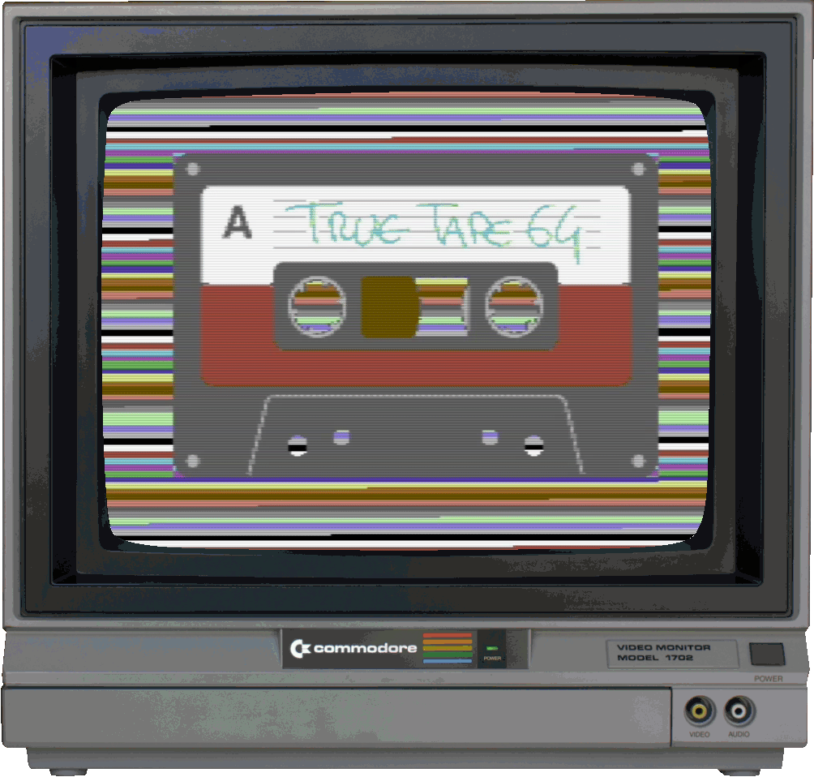
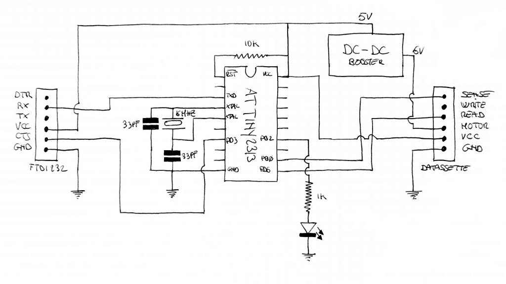
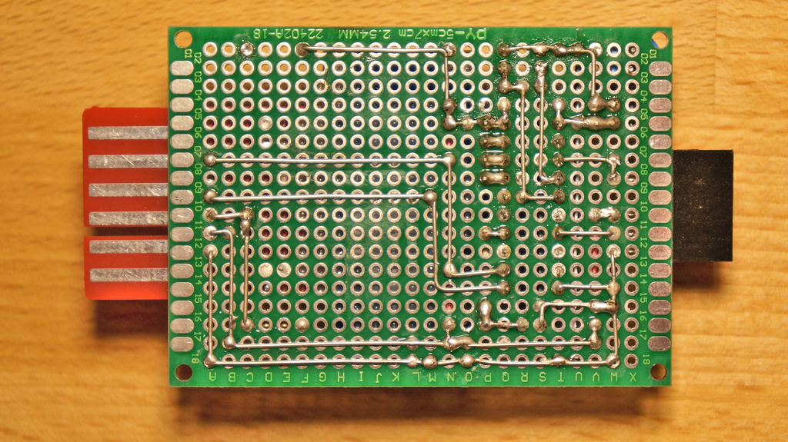
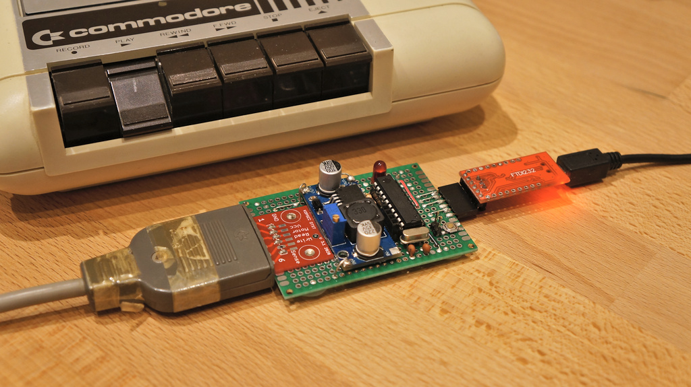

# TrueTape64

A cheap, easy to build adapter to interface a [Commodore 1530 (C2N) Datasette ](https://en.wikipedia.org/wiki/Commodore_Datasette) to your PC to dump and preserve your aging Commodore 64 software collection, as accurately as possible.


## What?!

Back in the '80s, many home computers used audio cassette tapes as a medium to to store data. Floppy disks already existed but they often required complex, dedicated hardware; tapes and tape decks on the other hand were cheap, common medium used for music and required simpler or in some cases (like Apple-II) no extra hardware or peripheral. Data was stored encoded as audio and it sounded very similar to the well-known squeaky modem / fax sounds. This storage method had obviously several downsides: long loading/saving times, wasn't "random access" so it required the user to manually advance the tape to the right position to access the desired file; and reliability depended a lot on the quality of the tape. But all these were more than acceptable compromises to keep the prices of these systems down and give everyone a cheap, good-enough way to access or build large software libraries.

As many other future developers born in the '80s, I've started writing BASIC code on a [Commodore 64](https://en.wikipedia.org/wiki/Commodore_64) when I was just a kid. Being still today a huge fan of this platform and having a large collection of tapes, during the past years I've found myself thinking about how to save all this data from the inevitable demise of its aging physical support. 

COVID-19 pandemic gave me some time to finally see if I could figure out how to do that and have some fun while doing it.

### But it has already been done...

Yes, this is certainly not the first project that addresses this issue; in fact I've tried a bunch of existing solutions in the past ([here](http://www.zimmers.net/anonftp/pub/cbm/crossplatform/transfer/datassette/index.html) a comprehensive list) before deciding to design my own device. 

One common approach is based only on clever software: the content of the tape is digitized via a standard audio tape deck (meant for music) connected to the input of a PC sound card. The software then analyzes the audio and extracts the data, performing a variety of corrections and fixes if necessary. This method is quite often the first that many people try, including myself, and usually it is good enough. It requires no weird hardware, however at least in my experience, it requires instead some trial and error; fiddling with volume levels, trying different tape decks and dumping the same tape multiple times to be sure it has been read correctly is the norm. This is because the hardware (tape deck and sound card) is designed for music, not for squeaky, highly-pitched noises. These kind of sounds can be very sensible to things like tape [wow and flutter](https://en.wikipedia.org/wiki/Wow_and_flutter_measurement) and to audio equalization or noise reduction filters; things designed to improve music, not data stored as audio.

Another less common approach involves hooking up the original Datassette to the PC via some sort of adapter. The roughest of these is probably [this one](http://web.archive.org/web/20071130192830/http://www.phs-edv.de/c64s/doc/lpt64.htm) which uses nothing more than a cable and the old-fashioned PC parallel port. This kind of approach requires some skills in building a bit of hardware and it also needs the original Datassette. However, the significant advantage over the software-only approach is that the output dump is closer to what a real Commodore machine would produce or ingest. This is due to the fact that the Datassette is a piece of dedicated hardware, featuring on-board specialized circuitry to clean and digitize the signal so that can be fed directly into the Commodore computer. 

### Design goals

I wanted this project to:

1) Be accurate: given a physical tape, loading it with a real C64 and its Datassette would produce the exact same result than loading the dump of that tape into an emulator when the dump is produced by the same Datassette coupled with this project
2) Be as simple as possible to build and use; bare minimum number of components, designed to be electrically tolerant, safe to use with vintage hardware and requiring minimal tuning; a companion software that does one thing only, but it does it well
3) Be pandemic-proof: all components needed to build the hardware are already in my junk drawer or are easy to obtain from online retailers
3) Be open source: there are similar commercially available devices, not all of them come with schematics or firmware source code. This one does.
4) Be fun and nostalgia fuelled: fiddle with technology designed at the end of the '70s, play with your favourite computer and, in the process, rescue code you wrote when you were 7.

What I've gotten so far:

* a simple hardware device that can be assembled in an hour for less than 10€
* a firmware for the Atmel AVR ATTiny2313 microcontroller which runs the device
* a simple Python command line tool that communicates with the microcontroller and generates a TAP dump of your tape

### Theory of operation

##### Pulse length encoding
The [TAP file format specifications](https://ist.uwaterloo.ca/~schepers/formats/TAP.TXT) gives already some good clues about how the data is stored on the tape and what the emulators such as [VICE](https://vice-emu.sourceforge.io/) expect to find. The Datassette page from [Wikipedia](https://en.wikipedia.org/wiki/Commodore_Datasette#Encoding) is also quite clear:

> To record physical data, the zero-crossing from positive to negative voltage of the analog signal is measured. The resulting time between these positive to negative crossings is then compared to a threshold to determine whether the time since the last crossing is short (0) or long (1).

In practice, the analog signal on the tape is a sine wave which goes from 0 to a minimum negative voltage, then to zero again, then to a maximum positive voltage and finally to zero again; this is fundamentally the entire sine period and it represents a "pulse". The hardware inside the Datassette converts the positive part into a TTL level equivalent to 1 and the negative part to a level equivalent to 0 and sends it over the cable.

This signal is then fed from the Datassette port directly into the C64 [Complex Interface Adapter (CIA)](https://www.c64-wiki.com/wiki/CIA) chip, which would simply run a counter clocked by the system clock to count how many clock cycles the sine period took to complete. In practice, the CIA measures how much time passed between two consecutive falling edges: 
* beginning of the current sine period: negative half-wave on tape, falling edge as seen by the CIA
* end of the current sine period, positive half-wave approaching 0, falling edge as seen by the CIA

If instead of feeding this signal to the CIA we feed it to a microcontroller with a fast enough clock, we could accurately capture the pulse length and then send it somehow to the software running on PC side; tihs is the basic principle behind this project. 

#### Clock speed

But how fast this clock needs to be? The original Commodore LOAD/SAVE routines in the C64 Kernal were designed to be resilient; they used long period pulses producing a relatively low frequency sound which could be safely stored even by low grade tape, but on the other hand loading/saving time were quite long. 

Developers quickly figured out that they could use their own routine to interact directly with the CIA and measure the lenght of each pulse, allowing them to use arbitrary pulse lengths, including very short ones; shorter pulses naturally meant faster loading time. [This article from COMPUTE! magazine](https://www.atarimagazines.com/compute/issue57/turbotape.html) from February 1985 gives an awesome (for a magazine) technical explanation about a popular "tape loader" of the era. Tape loaders were many so many are the different encodings you can find on old tapes. It's therefore obvious that we can't make any assumption on the length of the pulses we could find on the tape; we have to build something that can sample the shortest pulse the CIA can sample. 

We could run the microcontroller at the same clock speed used by the CIA, right? Yes, but how about running it more than TWICE as fast instead? This would ensure we capture data with twice the accuracy as the CIA would do.

##### Sending data over the PC

Once the pulse length is detected we need to send it to our software counterpart running on the PC for it to assemble into the output TAP file. Our microcontroller has a serial port that is fast enough to cope with the bitstream coming from the tape so interfacing that with a ultra common USB adapter is quite convenient. This also provides power to the entire system via the USB port.

##### The Datassette tape motor

The Datassette requires two input voltages: a 5V for the TTL logic and a ~6V for the tape motor.  As visible from the original C64 schematics, the C3 pin is fed from the unregulated 9V supplied by the power brick via a transistor and a 6.8V zener diode. This results in a quite stable ~6V output. However the motor voltage isn't critical; each datassette has a slightly different tape speed due to its rudimental mechanics, plus there are different models of Datassette around so the C64 has to be tolerant when measuring pulse length. 

To keep things simple, we opted to include a common DC-DC boost converter to take care of raising the voltage from the USB port from 5V to around 6.1V. Some similar projects use 5V for the motor, running the tape a bit slower and relying on software to compensate for this. I did not try this approach as I was aiming at accuracy but perhaps it would work good enough.

### Schematics and parts


Parts:

* 
* 16MHz crystal
* 33pF ceramic capacitors (2x)
* 10KΩ resistor
* 1KΩ resistor
* Red LED
* DC-DC booster module (for example, [this one](https://www.amazon.com/Converter-Voltage-Adjustable-Step-up-Circuit/dp/B07XG323G8/))
* FTDI232 serial to USB adapter (for example, [this one](https://www.amazon.com/HiLetgo-FT232RL-Converter-Adapter-Breakout/dp/B00IJXZQ7C/))
* Datassette edge connector (for example, [this one](https://www.ebay.com/itm/233499875028))
* 5x7 Perf board (for example [this one](https://www.amazon.com/uxcell-Universal-Printed-Circuit-Soldering/dp/B07FK5DWHR))
* 6 pins female header connector

The Datassette READ line is fed directly into PD6/ICP of the uC. This pin is the Input Capture Pin of the 16-bit Timer/Counter1 which can be programmed to generate an interrupt every time a falling edge is detected. The timer runs freely until either an overflow or a falling edge interrupt occurs. In the second case, this allows us to "timestamp" the edge with the value from the counter. 

The clock for the Timer/Counter1 is obtained by dividing by 8 the main clock, which is provided by the 16MHz crystal, giving a 2MHz sample rate. The C64 PAL clock (which is the default in the TAP format) is 985248Hz, so we are more than twice as fast. This should be more than enough to sample tapes for the NTSC model too (which runs at 1.023MHz) although this would probably require a little fix in the Python code. I have no NTSC tapes so I can't test this.

The SENSE line from the Datassette is essentially the output of a microswitch which is closed when one of the buttons on the Datassette is pressed. This is what makes the C64 detect that you "PRESSed PLAY ON TAPE". We capture this event with the micro and forward it to the Python client via the CTS line of the serial port hooked to PD3.

The led is there to signal "buffer overflow" conditions, which should normally never happen. A buffer overflow happens if the data rate from the tape exceeds the data rate of the serial port. We run the serial port at 250Kbps which should be more than enough for most tapes; however, since there is no hardware or software signaling implemented to notify the Python client that an overflow happened, you need to check this led at the end of the dump. If it had turned on, reset the device and try again.

Everything is powered by the USB port, including the DC-DC boost converter for the motor. 

### First (and probably last) prototype





Given the simplicity, the whole thing can be built on a perf board or even a breadboard if you don't need a permanent solution. Here the first prototype. The XL6009 booster board is hot-glued on top of the perfboard and connected with rigid wires.

**Adjust the DC-DC boost converter before hooking up a Datassette!** 

Hook up a multimeter between the MOTOR and the GND pins of the Datassette edge connector; using a flat screwdriver, turn the screw on the converter until you read about 6.15V on the multimeter. Now connect the Datassette, put a tape into it and press PLAY. If the voltage drops below 6.1V, adjust the screw again. In any circumstance, be sure the booster never outputs more than 6.5V or you would risk damaging your Datassette motor.

### AVR Firmware

The directory [avr](./avr) in this repo contains the source code of the ATTiny2313 firmware that runs the show on the adapter side. In the avr/cmake-build-debug directory there is a compiled version of the firmware that you can flash directly onto the AVR using the included Bash script. This script requires avrdude and the usbtiny programmer: check [lady ada tutorial](https://learn.adafruit.com/usbtinyisp/avrdude) for further instructions. 

If you flash with your own tool / programmer, remember to also program the fuses:

```
low: 0xFF
high: 0xDF
```

### Python CLI

A simple Python tool is included in the [cli](./cli) directory. The tool opens the serial port of the FTDI adapter and monitors its CTS line; when PLAY is pressed on the Datassette, the tool starts reading the data sent from the microcontroller. After some basic math to account for the differences in frequency between the AVR and the C64 PAL clock, the pulse length is written to the TAP file. The process continues until the CTS line status changes; this can happen either when the tape stops or when there is a buffer overflow; in the latter case, led on the board will be flashing fast until the tape is stopped.

The TAP v2 file format allows for pulse length values for up to 0xFFFFFF (3 bytes). The microcontroller always sends 3 bytes for each pulse, followed by a checksum byte. The checksum is just an extra measure to ensure there is no data corruption during the transfer between the microcontroller and the FTDI adapter, for instance due to a bad solder joint.

See the [README](./cli/) included with the tool for further instructions.

## License
[GPLv3](./LICENSE)

## As seen on Hackaday

This project has been featured on [Hackaday](https://hackaday.com/2021/05/10/truetape64-is-a-pc-interface-for-your-c64-datasette/)
